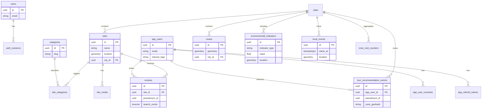

# Entity-relationship diagram

**Status:** Draft for ΑΠΘ & PM review — **formal approval pending**.

```mermaid
erDiagram
  users ||--o{ auth_sessions : has
  app_users ||--o{ app_user_consents : has
  app_users ||--o{ app_refresh_tokens : has
  app_users ||--o{ tour_recommendation_events : interacts
  app_users ||--o{ reviews : writes
  categories ||--o{ site_categories : classifies
  sites ||--o{ site_categories : tagged
  sites ||--o{ site_media : has
  sites ||--o{ reviews : receives
  cities ||--o{ sites : contains
  cities ||--o{ routes : contains
  cities ||--o{ environmental_indicators : samples
  cities ||--o{ local_events : hosts
  cities ||--o{ tour_recommendation_events : zones
  cities ||--o{ zone_visit_counters : aggregates

  users {
    uuid id PK
    string email
  }
  app_users {
    uuid id PK
    string email
    string interest_tags
  }
  sites {
    uuid id PK
    string name
    geometry location
    uuid city_id FK
  }
  categories {
    uuid id PK
    string slug
  }
  routes {
    uuid id PK
    geometry geometry
    uuid city_id FK
  }
  reviews {
    uuid id PK
    uuid site_id FK
    uuid pseudonym_id
    tsvector search_vector
  }
  local_events {
    uuid id PK
    timestamptz starts_at
    geometry location
  }
  environmental_indicators {
    uuid id PK
    string indicator_type
    float value
    geometry location
  }
  tour_recommendation_events {
    uuid id PK
    uuid app_user_id FK
    uuid pseudonym_id
    string zone_geohash
  }
```

See [schema.md](schema.md) for the DoD name mapping.
