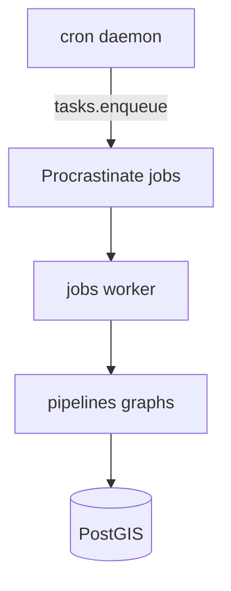

# Data ingestion — PerTouriSM (Pelion)

External geospatial and environmental sources for the Pelion pilot, scheduled via the twin-style **cron + Procrastinate** stack vendored from GeoTwin-ELBG / aqua-guard.

## Architecture



| Component | Path | Role |
|-----------|------|------|
| Scheduler | `cron/` | UTC cron → defer graphs |
| Queue | `jobs/` | Procrastinate on Postgres |
| Tasks | `tasks/` | `run_pipeline_graph` |
| Graphs | `storage/pipelines/` | Bonobo ETL |
| Clients | `sources/cams`, `sources/osm` | ADS / Overpass |

## Sources, licenses, refresh

| Source | Graphs | License | Refresh |
|--------|--------|---------|---------|
| OpenStreetMap (Overpass / Geofabrik) | `osm_pelion` | [ODbL 1.0](https://www.openstreetmap.org/copyright) | Monthly (`0 4 1 * *`) |
| Copernicus CAMS (ADS) | `cams_air_quality` | [Copernicus licence](https://atmosphere.copernicus.eu/data-protection-privacy-statement) | Every 6h (`0 */6 * * *`) |
| ELSTAT CSV | `elstat_stats` | National Statistics terms of use | Yearly / on demand |

Provenance columns on loaded rows: `source`, `source_id`, `imported_at`.

## Local run

```bash
make infra.up migrate
make jobs.schema
make jobs.start          # worker (required for deferred jobs)
make cron.start          # scheduler
make cron.list

# Sync runs (bypass queue):
make etl.cams
make etl.osm
make etl.elstat
make etl.qa
```

Set `CAMS_API_KEY` for live ADS pulls. Without it, `PIPELINES_ALLOW_MOCK=true` (default) writes synthetic Pelion samples so graphs stay runnable.

Enqueue one job: `make cron.run-now JOB=cams` (needs worker).

## ΑΠΘ read-only access

```bash
psql "postgresql://pertourism:…@localhost:5432/pertourism" \
  -f scripts/create_aph_readonly_role.sql
```

Role `pertourism_aph_readonly` has `SELECT` on geospatial/reference tables only (no `app_users` / auth).

## Recommendations

Ranking and suggested-route geometry consume ingested PostGIS layers:

- **OSM POIs** → `sites` (interest/proximity ranking)
- **OSM paths** → `routes` (suggested-route LineString when near the stop corridor)
- **CAMS** → `environmental_indicators` (`pm25` / weather soft bias)
- **Settlements** → village-anchored POI boost
- **ELSTAT** → municipality population prior (soft)

See `recommendations/enrichment.py`.

## Category schema

See [poi-categories.md](poi-categories.md).

## QA

`make etl.qa` samples OSM POI density near Pelion village anchors; capture findings in [qa-report.md](qa-report.md).
